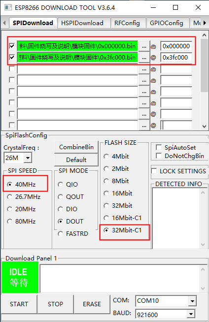

# esp8266使用说明

## 烧写固件



## 串口AT指令配置

```C
AT+CWMODE=1 //设置未sta模式，即客户端模式
AT+RST //重启
/*
AT+CWJAP="SSID","PASSWORD"
连接路由,接入点名称和密码
*/
AT+CWJAP="LAPTOP","lm123456"
AT+CIFSR //获取本地 IP 地址即wifi模块地址 
/*
AT+CIPSTART=<type>,<addr>,<port>
<type> 字符串参数，表明连接类型
	”TCP” 建立 TCP 连接
	”UDP” 建立 UDP 传输
    ”SSL” 建立 SSL 连接
<addr> 字符串参数，远程服务器 IP 地址
<port> 远程服务器端口号
远程服务器ip与WiFi模块需在同一网段，端口需要未使用且通过防火墙
*/
AT+CIPSTART="TCP","192.168.137.1",8087 
```

以上wifi模块即可与服务器通讯